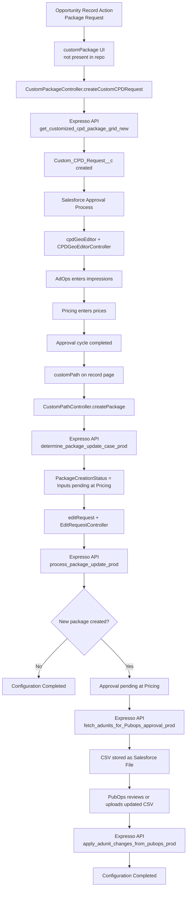
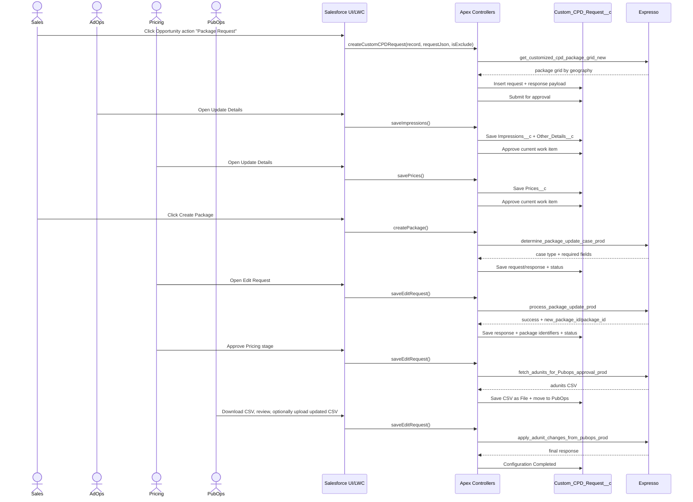

f# Custom CPD Request Flow Documentation

## 1. Purpose

This document explains the Salesforce implementation for creating and completing a `Custom_CPD_Request__c` request in the TIL Sales project.

The scope starts from the Opportunity action **Package Request** and ends when the package configuration is completed in Expresso.

This documentation combines:

- business flow
- technical architecture
- Apex and LWC responsibilities
- approval and status transitions
- Lightning Message Service coordination
- Expresso API interactions
- object field usage
- file-by-file explanation of the implementation present in this repository

## 2. Important Repository Note

The repository contains the Apex controller `CustomPackageController.cls`, but the `customPackage` LWC bundle itself is not present in this checkout under `force-app/main/default/lwc`.

Because of that, the documentation for the Opportunity entry screen is reconstructed from:

- `CustomPackageController.cls`
- the persisted fields on `Custom_CPD_Request__c`
- the downstream components and controllers
- the business process description you provided

So the backend contract for request creation is code-backed, while some front-end behavior of the initial `customPackage` screen is inferred from the process and the controller methods.

## 3. Business Goal

The system allows a user to raise a **Custom CPD Request** from an Opportunity, collect internal approvals and pricing inputs, interact with Expresso APIs, and finally make the package live in Expresso.

There are two major phases:

1. **Request Definition and Approval Phase**
   The user chooses an existing package or creates a new combination of inclusions and geographies, then AdOps and Pricing complete the first approval cycle.

2. **Package Creation / Configuration Phase**
   After approval, the request moves into package creation in Expresso, Pricing shares package creation inputs, PubOps reviews adunits, and the final package configuration is completed.

## 4. Actors

- **Sales User**
  Initiates the request from Opportunity and tracks progress.

- **AdOps Team**
  Supplies impressions and other delivery metadata for each geo; later PubOps/AdOps reviews adunit CSV before final completion.

- **Pricing Team**
  Supplies geo pricing in phase 1, then package creation inputs and innovation ratios in phase 2.

- **PubOps Team**
  Reviews adunits generated from Expresso and can optionally upload a modified CSV.

- **Expresso**
  External system that calculates package grids, determines package creation case type, creates/updates packages, and applies adunit changes.

## 5. Functional Cases at Request Creation

The initial `customPackage` experience supports 3 cases:

### Case 1. Modify Existing Package: Geo Updation

- User selects an existing package.
- User does not change package constitution.
- Only geo-level customization is requested.
- `Constitute_Changed__c = false`
- Downstream effect:
  - `customPath` hides Pricing and PubOps approval stages.
  - Expresso can treat this as geography updation rather than full new package creation.

### Case 2. Modify Existing Package: New Package Over Existing Package

- User selects an existing package.
- User changes rows using inclusion parameters by adding/removing rows.
- This changes the constitution of the package.
- `Constitute_Changed__c = true`
- Downstream effect:
  - full package creation path is used
  - Pricing and PubOps stages are shown

### Case 3. New Package

- No existing package is selected.
- User builds the package through inclusion selections.
- This is effectively a new package creation flow.
- `Constitute_Changed__c = true`

## 6. End-to-End Lifecycle

### Phase A. Request Raised from Opportunity

1. User opens an Opportunity.
2. User clicks record action **Package Request**.
3. `customPackage` opens in a new tab.
4. User selects geographies and inclusion rows.
5. The system calls Expresso endpoint `get_customized_cpd_package_grid_new`.
6. A `Custom_CPD_Request__c` record is inserted.
7. Email notifications are sent.
8. The record is auto-submitted into Salesforce approval.

### Phase B. First Approval Cycle

1. AdOps uses `cpdGeoEditor` from the CPD record action **Update Details**.
2. AdOps enters impressions and saves.
3. The controller approves the current approval work item.
4. Pricing receives the next approval task.
5. Pricing uses the same `cpdGeoEditor`.
6. Pricing enters prices and saves.
7. The controller approves the second approval work item.
8. The first approval cycle is complete.

### Phase C. Package Creation Cycle

1. `customPath` becomes meaningful on the CPD record page.
2. User clicks **Create Package**.
3. Expresso determines whether the request is geo-update vs new package creation and returns required fields.
4. `PackageCreationStatus__c` moves to `Inputs pending at Pricing`.
5. Pricing uses `editRequest` to provide package-level inputs.
6. Salesforce calls Expresso package-processing APIs.
7. If a new package is created, Pricing approval and PubOps approval stages follow.
8. PubOps/AdOps reviews the adunit CSV.
9. Salesforce sends the latest CSV back to Expresso.
10. `PackageCreationStatus__c` becomes `Configuration Completed`.

## 7. Architecture Overview



## 8. Sequence Diagram



## 9. Status Model

This implementation uses **two parallel state tracks**.

### 9.1 `Approval_Status__c`

This field controls the first approval process related to request validation.

Defined picklist values:

- `Draft`
- `Pending With AdOps Team`
- `Pending With Pricing Team`
- `Rejected`
- `Approved`

Meaning:

- This status represents the pre-package-creation approval flow.
- It is driven by Salesforce Approval Process and the `CPDGeoEditorController`.
- AdOps and Pricing update geo-level data in this phase.

### 9.2 `PackageCreationStatus__c`

This field controls the second lifecycle, after the first approval cycle is complete.

Defined picklist values in metadata:

- `Package Creation Requested`
- `Inputs pending at Pricing`
- `Approval pending at Pricing`
- `Approval pending at PubOps`
- `Configuration Completed`
- `Rejected by Pub Ops`

Observed runtime behavior in code:

- `CustomPathController.createPackage()` moves status to `Inputs pending at Pricing`.
- `EditRequestController.handleMainResponse()` moves status to:
  - `Approval pending at Pricing` if Expresso returns `new_package_id`
  - `Configuration Completed` if Expresso returns `package_id`
- `EditRequestController.getAdSlots()` moves status to `Approval pending at PubOps`.
- `EditRequestController.uploadAdstots()` moves status to `Configuration Completed`.

Important theoretical point:

- `Approval_Status__c` answers: "Has the request itself been approved internally?"
- `PackageCreationStatus__c` answers: "How far has package creation/configuration progressed in Expresso?"

## 10. State Transition Table

| Stage | Trigger | Controller/Component | Result |
|---|---|---|---|
| Request submitted | User creates CPD request | `CustomPackageController.createCustomCPDRequest` | record inserted, approval started |
| Pending with AdOps | Approval routing | Salesforce Approval Process | AdOps becomes actor |
| Pending with Pricing | AdOps saves & approves | `CPDGeoEditorController.saveImpressions` | Pricing becomes actor |
| Approved | Pricing saves & approves | `CPDGeoEditorController.savePrices` | first approval cycle complete |
| Package Creation Requested | record page path shows create action | `customPath` | user can initiate package creation |
| Inputs pending at Pricing | user clicks Create Package | `CustomPathController.createPackage` | Expresso returns required fields |
| Approval pending at Pricing | Pricing shares package inputs | `EditRequestController.saveEditRequest` + `process_package_update_prod` | new package created in Expresso, waiting pricing approval |
| Approval pending at PubOps | Pricing approval saved | `EditRequestController.getAdSlots` | adunits CSV created and attached |
| Configuration Completed | PubOps approval saved | `EditRequestController.uploadAdstots` | final CSV applied in Expresso |

## 11. External API Inventory

All callouts are made through the Named Credential alias:

- `callout:TimesInternetAPI/...`

This means the actual auth headers and base URL should be managed in Salesforce configuration, not hardcoded in Apex.

### 11.1 `get_customized_cpd_package_grid_new`

Used in:

- `CustomPackageController.createCustomCPDRequest`

Purpose:

- convert the selected geo + inclusion combinations into a normalized package grid grouped by geography

Request concept:

```json
[
  {
    "geo": ["India", "New Delhi"],
    "inclusion": [
      ["TOI", "WAP", "HP", "Mrec"],
      ["TOI", "Web", "HP", "Mrec"]
    ]
  }
]
```

Response concept:

```json
[
  {
    "geo": "India",
    "package_grid": [
      {
        "Portal": "TOI",
        "Platform": "WAP + Web",
        "Section": "HP",
        "Adspot": "Mrec"
      }
    ]
  }
]
```

Persistence:

- response is saved in `PackageGridResponse__c`

### 11.2 `determine_package_update_case_prod`

Used in:

- `CustomPathController.makeCallout`

Purpose:

- determine whether the request is a geo update or a new package creation scenario
- tell Salesforce what additional fields Pricing must provide
- return `distinct_adspots` for innovation ratio inputs

Persistence:

- request saved in `CreatePackageRequestBody__c`
- response saved in `CreatePackageResponse__c`

### 11.3 `process_package_update_prod`

Used in:

- `EditRequestController.saveEditRequest` when status is `Inputs pending at Pricing`

Purpose:

- create or update the package in Expresso using package name, package ID, geographies, inclusions, ratios, comments, and case type

Persistence:

- request saved in `EditRequestBody__c`
- response saved in `EditRequestResponse__c`
- ratios saved in `InnovationWiseRatios__c`
- comments saved in `EditRequestComment__c`
- resulting package id saved in `PackageId__c`

### 11.4 `fetch_adunits_for_Pubops_approval_prod`

Used in:

- `EditRequestController.getAdSlots`

Purpose:

- fetch adunits CSV after Pricing approval so PubOps can review mapping before go-live

Persistence:

- request saved in `EditRequestBody2__c`
- CSV saved as Salesforce File named `Adunits_Response.csv`

### 11.5 `apply_adunit_changes_from_pubops_prod`

Used in:

- `EditRequestController.uploadAdstots`

Purpose:

- send the latest reviewed/uploaded CSV back to Expresso for final adunit application

Persistence:

- response saved in `EditRequestResponse3__c`
- status becomes `Configuration Completed`

## 12. Data Model: `Custom_CPD_Request__c`

The custom object is the central transaction record for the entire flow.

### 12.1 Core Identification Fields

- `Name`
  Auto number with format `CP-R-{00000}`

- `Opportunity__c`
  parent Opportunity from which request is initiated

- `Package__c`
  selected source package, if any

- `PackageType__c`
  pricing type / package type such as CPD, CPU, CPM

### 12.2 Request Definition Fields

- `Geo__c`
  comma-separated geo list

- `Include__c`
  stored include selections

- `Exclude__c`
  stored exclusion selections

- `Comment__c`
  request comment from initiator

- `Constitute_Changed__c`
  core boolean that decides whether this is only geo-update or full constitution change

- `FullGeneratedGrid__c`
  long text JSON representing the editable package grid used by downstream package creation APIs

- `PackageGridResponse__c`
  raw response from `get_customized_cpd_package_grid_new`

### 12.3 First Approval Cycle Fields

- `Approval_Status__c`
  first approval state

- `Impressions__c`
  comma-separated impressions aligned by geo index

- `Prices__c`
  comma-separated prices aligned by geo index

- `Other_Details__c`
  JSON array of geo-level additional metrics such as Reach, CTR, Viewability, Remarks

### 12.4 Package Creation Phase Fields

- `PackageCreationStatus__c`
  second-stage package creation lifecycle field

- `CreatePackageRequestBody__c`
  stored payload sent to `determine_package_update_case_prod`

- `CreatePackageResponse__c`
  stored response from `determine_package_update_case_prod`

- `PackageId__c`
  target/new package id returned by Expresso

- `PackageName__c`
  package name entered in package creation flow

- `InnovationWiseRatios__c`
  JSON map of innovation ratios entered by Pricing

- `EditRequestComment__c`
  comment entered in package creation flow

- `EditRequestBody__c`
  request payload sent to `process_package_update_prod`

- `EditRequestResponse__c`
  response from `process_package_update_prod`

- `EditRequestBody2__c`
  request payload sent to `fetch_adunits_for_Pubops_approval_prod`

- `EditRequestResponse3__c`
  response from `apply_adunit_changes_from_pubops_prod`

- `EditRequestAuditTrail__c`
  JSON audit map used by the UI path to show who completed which stage and when

## 13. File-by-File Documentation

## 13.1 Apex Controllers

### `force-app/main/default/classes/CustomPackageController.cls`

Role:

- backend for the initial request creation experience
- loads packages, geos, inclusion options, existing package grid, and creates the initial CPD request

Key methods:

- `getPackages(packageName, packageType)`
  searches active `Package__c` records for dropdown selection

- `getMasterGeoLocations(searchKey, selectedGeos)`
  loads selectable geographies from `Geo_Master__c`

- `getGeoOptions()`
  returns all geos

- `getInclusionOptions(packageType)`
  returns distinct portal/platform/section/adspot options from `Inclusion__c`

- `getSectionOptions(packageType, businesses, innovations, platforms)`
  filters section options based on other inclusion dimensions

- `getGeoLocationTableData(packageId)`
  loads existing geo targeting and pricing rows from `Sf_CPD_Geo_Targeting_Price__c`

- `getDefaultCPDPackageRequestId()`
  returns a default package based on custom label `DefaultCPDPackage`

- `getPackageDetailsGridWise(packageId)`
  loads `PackageCharacteristic__c` rows for the selected source package

- `createCustomCPDRequest(record, requestJson, isExclude)`
  most important method in the class

Detailed logic of `createCustomCPDRequest`:

1. sends POST request to `get_customized_cpd_package_grid_new`
2. stores raw grid response in `PackageGridResponse__c`
3. inserts the `Custom_CPD_Request__c`
4. sends email to internal team
5. sends confirmation email to requester
6. auto-submits the record into Salesforce approval
7. returns the created record id

Theoretical importance:

- this method is the boundary where a user-defined configuration becomes a governed workflow item
- it converts a temporary UI selection into a persisted request, an API snapshot, an approval item, and an email-triggered business process

### `force-app/main/default/classes/CPDGeoEditorController.cls`

Role:

- supports the first approval cycle after request creation
- lets AdOps and Pricing enter geo-aligned values and approve or reject

Key methods:

- `getCPDRecord(recordId)`
  returns:
  - CPD record
  - field editability
  - whether action buttons should be visible to current user based on approval work item ownership

- `saveImpressions(recordId, impressions, otherDetails)`
  used by AdOps

  Responsibilities:
  - validates record id
  - validates field-level update access
  - ensures impression count equals geo count
  - stores impressions into `Impressions__c`
  - stores auxiliary values into `Other_Details__c`
  - auto-approves the current approval work item
  - sends Pricing notification email

- `savePrices(recordId, prices)`
  used by Pricing

  Responsibilities:
  - validates price count against geo count
  - stores prices into `Prices__c`
  - auto-approves the current approval work item
  - sends resolution email

- `rejectCPD(recordId, isAdops, isPricing, comment)`
  rejects the current approval work item and sends rejection email

Design intuition:

- the controller aligns geo, impression, and price data by **list index**, not child records
- this is lightweight and easy for transport, but it means data integrity depends on preserving index ordering

### `force-app/main/default/classes/CustomPathController.cls`

Role:

- controls the second-stage visual path and starts the package creation phase

Key methods:

- `getPackageCreationStatus(recordId)`
  returns `PackageCreationStatus__c`, `EditRequestAuditTrail__c`, and `Constitute_Changed__c`

- `createPackage(recordId)`
  starts the package creation phase

Detailed logic:

1. fetches request using `getRequest`
2. builds `RequestWrapper`
3. serializes geographies from:
   - `Geo__c`
   - `Impressions__c`
   - `Prices__c`
4. serializes inclusions from `FullGeneratedGrid__c`
5. sends callout to `determine_package_update_case_prod`
6. updates:
   - `PackageCreationStatus__c = Inputs pending at Pricing`
   - `CreatePackageRequestBody__c`
   - `CreatePackageResponse__c`
7. writes `PackageCreated` into `EditRequestAuditTrail__c`
8. sends sales + pricing emails

Key theoretical role:

- this controller transforms the request from "approved business intent" into "Expresso package creation workflow"

### `force-app/main/default/classes/EditRequestController.cls`

Role:

- drives the package creation lifecycle after `Create Package`
- same action/component behaves differently depending on current `PackageCreationStatus__c`

This is the central state-machine controller for phase 2.

Key methods:

- `getEditRequestData(recordId)`
  supplies current status and previously stored create-package response to the LWC

- `getAdunitFile(recordId)`
  finds latest attached `Adunits_Response.csv` file for download

- `saveEditRequest(recordId, formDataJson)`
  main branching method

Branching behavior:

1. If status is `Inputs pending at Pricing`
   - build wrapper
   - call `process_package_update_prod`
   - update request fields
   - set audit key `InputShared`

2. If status is `Approval pending at Pricing`
   - call `getAdSlots`
   - move to `Approval pending at PubOps`
   - attach CSV file
   - set audit key `ApprovedByPricing`

3. If status is `Approval pending at PubOps`
   - call `uploadAdstots`
   - send latest CSV back to Expresso
   - move to `Configuration Completed`
   - set audit key `ApprovedByPubops`

Supporting methods:

- `updateAuditField(recordId, key)`
  appends `username - timestamp` to JSON audit trail

- `buildWrapper(record, formData)`
  creates payload for `process_package_update_prod`

- `buildGeographies(record)`
  reuses geo, price, impression strings to create API geographies

- `buildInclusions(record)`
  extracts non-deleted rows from `FullGeneratedGrid__c`

- `handleMainResponse(res, recordId, wrapper, formData)`
  interprets Expresso response and updates package id, status, ratios, and comments

- `getAdSlots(recordId, packageId)`
  calls `fetch_adunits_for_Pubops_approval_prod`, stores CSV as file, notifies users

- `uploadAdstots(recordId)`
  reads latest file attached to record, converts it to request body, and calls `apply_adunit_changes_from_pubops_prod`

- `uploadCSVFile(data, fileName, recordId)`
  stores either plain text or base64-decoded file content as `ContentVersion`

Design intuition:

- this class acts as a **workflow router**
- the same button in the UI means different backend behavior based entirely on persisted state
- this is a classic state-driven orchestration pattern

### `force-app/main/default/classes/CPDEmailService.cls`

Role:

- centralized email formatter and dispatcher for both approval phases

Capabilities:

- loads request and record URL
- renders package grid HTML tables from `PackageGridResponse__c`
- optionally adds impressions, prices, reach/CTR/viewability, and remarks
- chooses recipients by email type

Important email types:

- `REQUEST_TO_TEAM`
- `REQUEST_TO_SALES`
- `PRICING_UPDATE`
- `FINAL_RESOLVED`
- `REJECTED`
- `CREATE_PACKAGE_SALES_CONFIRMATION`
- `CREATE_PACKAGE_TO_PRICING`
- `PRICING_GEO_UPDATED`
- `PRICING_INPUT_SHARED`
- `PACKAGE_CREATED_EXPRESSO`
- `PRICING_APPROVED`
- `PUBOPS_APPROVAL_REQUEST`
- `PUBOPS_FINAL_STATUS`

### `force-app/main/default/classes/EmailType.cls`

Role:

- enum used by `CPDEmailService` to keep email invocation strongly typed

## 13.2 LWC Components

### `force-app/main/default/lwc/cpdGeoEditor`

Role:

- record action modal used as **Update Details**
- serves both AdOps and Pricing during the first approval cycle

Metadata target:

- `lightning__RecordAction`
- `actionType = ScreenAction`

UI behavior:

- loads package grid from `PackageGridResponse__c`
- groups rows by geo
- allows editing:
  - impressions
  - prices
  - reach
  - CTR
  - viewability
  - remarks
- exports the current table to Excel using SheetJS
- Save action both persists data and approves the current work item
- Reject action rejects the approval task

Notable implementation detail:

- impressions are displayed in millions in the UI, but stored/sent as absolute numbers

### `force-app/main/default/lwc/customPath`

Role:

- record page progress tracker for phase 2

Metadata target:

- `lightning__RecordPage`

UI behavior:

- before package creation: shows **Create Package** button
- after package creation starts: shows a visual path of package creation stages
- reads audit timestamps from `EditRequestAuditTrail__c`
- dynamically hides Pricing/PubOps stages if `Constitute_Changed__c = false`

Lightning Message Service:

- subscribes to `CPDPathRefresh__c`
- refreshes when `editRequest` publishes a refresh event

This is the visual state projection of the second-stage workflow.

### `force-app/main/default/lwc/editRequest`

Role:

- record action + record-page-enabled component used after `Create Package`

Metadata target:

- `lightning__RecordPage`
- `lightning__RecordAction`

UI behavior varies by `PackageCreationStatus__c`.

When `Inputs pending at Pricing`:

- shows required fields returned by Expresso
- lets Pricing enter:
  - package name
  - package id
  - comments
  - innovation-wise ratios

When `Approval pending at Pricing`:

- acts like an approval checkpoint
- save action calls `getAdSlots`

When `Approval pending at PubOps`:

- requires download of generated CSV
- optionally allows upload of modified CSV
- validates headers before upload
- save action sends latest CSV to Expresso

Important front-end logic:

- innovation ratios must total exactly 1
- CSV headers must match:
  - `Website`
  - `Innovation`
  - `Position__c`
  - `Section__c`
  - `Innovation_dim_id`
  - `adslot_name`
  - `adslot_id`
- after save success it publishes LMS message so `customPath` refreshes

### `force-app/main/default/lwc/createPackage`

Role:

- currently empty placeholder component in this repository

## 13.3 Message Channel

### `force-app/main/default/messageChannels/CPDPathRefresh.messageChannel-meta.xml`

Role:

- defines LMS channel with field `refresh`
- used so `editRequest` can notify `customPath` to refresh its stepper without full page reload

Theoretical importance:

- this is a decoupled communication mechanism between sibling components on the same record page
- avoids tight component coupling and keeps the path reactive

## 14. How the Data Is Shaped Across the Flow

### 14.1 Grid Representation

There are two major JSON structures:

1. `PackageGridResponse__c`
   Raw Expresso response grouped by geography:

```json
[
  {
    "geo": "India",
    "package_grid": [
      {
        "Portal": "TOI",
        "Platform": "WAP + Web",
        "Section": "HP",
        "Adspot": "Mrec"
      }
    ]
  }
]
```

2. `FullGeneratedGrid__c`
   Internal editable grid used for downstream package creation APIs:

```json
[
  {
    "Portal__c": "TOI",
    "Platform__c": "Web",
    "Section__c": "ROS",
    "Adspot__c": "Billboard",
    "deleted": false
  }
]
```

Important distinction:

- `PackageGridResponse__c` is the rendered output of initial customization
- `FullGeneratedGrid__c` is the internal normalized editable package constitution used to build future APIs

### 14.2 Geography Alignment Model

The implementation stores geo-linked values in comma-separated strings:

- `Geo__c`
- `Impressions__c`
- `Prices__c`

Example:

```text
Geo__c = India, New Delhi
Impressions__c = 5000000, 1000000
Prices__c = 50000, 12000
```

Meaning:

- index 0 in all 3 fields belongs to `India`
- index 1 in all 3 fields belongs to `New Delhi`

Why this matters:

- all wrapper builders reconstruct the API geography list by index
- therefore geo order is semantically important

### 14.3 Audit Trail Model

`EditRequestAuditTrail__c` stores JSON like:

```json
{
  "PackageCreated": "User A - 12 Apr 2026 10:45 AM",
  "InputShared": "User B - 12 Apr 2026 12:20 PM",
  "ApprovedByPricing": "User C - 12 Apr 2026 02:05 PM",
  "ApprovedByPubops": "User D - 12 Apr 2026 04:40 PM"
}
```

This is used by `customPath` to render who completed which stage.

## 15. First Approval Cycle: Detailed Explanation

This phase ensures that the request is commercially and operationally valid before package creation is attempted.

### AdOps Step

- record action `cpdGeoEditor` opens
- `getCPDRecord` determines whether current user can edit impressions
- AdOps fills:
  - impressions
  - reach
  - CTR
  - viewability
  - remarks
- `saveImpressions` updates:
  - `Impressions__c`
  - `Other_Details__c`
- the current approval work item is approved automatically

### Pricing Step

- same UI is reused
- field editability determines the pricing persona behavior
- Pricing fills price per geo
- `savePrices` updates `Prices__c`
- the current approval work item is approved automatically

Theoretical interpretation:

- this is a role-sensitive reuse of one component for two approval actors
- the actor is not chosen by separate components, but by:
  - field permissions
  - approval work item ownership

## 16. Second Lifecycle: Detailed Explanation

### 16.1 Create Package Button

When the first approval cycle ends, `customPath` exposes **Create Package**.

`CustomPathController.createPackage()` sends Expresso a package creation context including:

- package id of source package
- geographies with impression and price
- inclusion rows
- whether constitution changed

Expresso replies with:

- case type
- required fields
- distinct adspots

This response controls the `editRequest` UI.

### 16.2 Pricing Input Stage

`editRequest` parses `CreatePackageResponse__c` and dynamically shows the needed inputs.

Typical inputs:

- package name
- package id to be cloned
- comments
- innovation-wise ratios

Ratios are required because adspots/innovations may need weight distribution and the total must equal 1.

### 16.3 Pricing Approval Stage

If Expresso returns a `new_package_id`, Salesforce interprets that as a new package creation scenario requiring another approval checkpoint.

At this stage:

- `saveEditRequest` triggers `getAdSlots`
- Expresso returns adunits CSV
- CSV is attached to the CPD record
- status becomes `Approval pending at PubOps`

### 16.4 PubOps Approval Stage

PubOps or downstream operational user:

- downloads the generated CSV
- reviews mappings
- optionally uploads revised CSV

The latest attached file is then sent to Expresso through `apply_adunit_changes_from_pubops_prod`.

After that:

- package configuration is complete
- package is live in Expresso

## 17. LMS Usage

`editRequest` publishes refresh messages:

```text
publish(this.messageContext, REFRESH_CHANNEL, { refresh: true })
```

`customPath` subscribes with application scope and calls `loadData()` when it receives a message.

Why LMS is important here:

- `customPath` and `editRequest` are separate components
- both can be present on the same record page
- after a save, the path needs to update immediately
- LMS provides event-based synchronization without parent-child dependency

## 18. Email Flow Summary

### On request creation

- internal team email
- requester confirmation email

### After AdOps submits impressions

- Pricing update email

### After Pricing finishes first cycle

- final resolved email for request-definition phase

### After package creation is initiated

- sales confirmation email
- Pricing request email

### After Pricing shares package inputs

- sales notified that pricing input was shared
- Pricing asked to review package created in Expresso

### After Pricing approval for package creation

- sales notified
- PubOps approval requested

### After final PubOps completion

- requester and Pricing are notified that package is live

## 19. Theoretical Design Interpretation

This project is a good example of a **multi-stage orchestration system inside Salesforce**.

It uses several architectural patterns:

### 19.1 State-Driven UI

The same component behaves differently depending on persisted state:

- `Approval_Status__c`
- `PackageCreationStatus__c`
- `CreatePackageResponse__c`

This reduces the number of separate screens but increases the importance of clean state transitions.

### 19.2 Approval + Integration Hybrid Workflow

The process is not purely Salesforce and not purely external-system driven.

Instead:

- Salesforce controls approvals, user actions, file handling, and auditability
- Expresso controls package computation and final operational execution

### 19.3 Persisted Integration Snapshots

Request and response payloads are stored directly on the CPD record:

- `CreatePackageRequestBody__c`
- `CreatePackageResponse__c`
- `EditRequestBody__c`
- `EditRequestResponse__c`
- `EditRequestBody2__c`
- `EditRequestResponse3__c`

This is important for:

- debugging
- auditability
- post-failure investigation
- support handoff

### 19.4 Human-in-the-Loop File Review

The PubOps step intentionally introduces CSV review between API steps.

That means the architecture accepts that some package mappings require human validation rather than full automation.

## 20. Gaps / Assumptions

### Missing in this repository

- `customPackage` LWC implementation
- approval process metadata
- Opportunity action metadata that launches `customPackage`
- page layout / flexipage configuration beyond the CPD record object metadata
- Named Credential definition for `TimesInternetAPI`

### Therefore, the following are inferred

- exact Opportunity-side UI interaction details inside `customPackage`
- exact mapping of action button labels to deployed Lightning components on Opportunity
- approval routing rule details beyond what is implied by `ProcessInstanceWorkitem`

## 21. Recommended Mental Model

If you want to explain this project to another developer, the simplest accurate mental model is:

1. Salesforce captures a custom package request from Opportunity.
2. Expresso returns the geo-wise package grid.
3. Salesforce runs an AdOps then Pricing approval cycle to enrich the request with impressions and pricing.
4. Salesforce then asks Expresso what kind of package creation is needed.
5. Pricing provides package creation inputs and ratio distributions.
6. If needed, Expresso creates a new package and sends adunits for PubOps review.
7. Salesforce stores the CSV, lets PubOps modify it, and sends the final version back to Expresso.
8. Expresso completes configuration and the request closes as `Configuration Completed`.

## 22. Short File Index

- [CustomPackageController.cls](/c:/Users/dhrub/Desktop/Lwc/TIL%20Sales/force-app/main/default/classes/CustomPackageController.cls)
- [CPDGeoEditorController.cls](/c:/Users/dhrub/Desktop/Lwc/TIL%20Sales/force-app/main/default/classes/CPDGeoEditorController.cls)
- [CustomPathController.cls](/c:/Users/dhrub/Desktop/Lwc/TIL%20Sales/force-app/main/default/classes/CustomPathController.cls)
- [EditRequestController.cls](/c:/Users/dhrub/Desktop/Lwc/TIL%20Sales/force-app/main/default/classes/EditRequestController.cls)
- [CPDEmailService.cls](/c:/Users/dhrub/Desktop/Lwc/TIL%20Sales/force-app/main/default/classes/CPDEmailService.cls)
- [cpdGeoEditor.js](/c:/Users/dhrub/Desktop/Lwc/TIL%20Sales/force-app/main/default/lwc/cpdGeoEditor/cpdGeoEditor.js)
- [customPath.js](/c:/Users/dhrub/Desktop/Lwc/TIL%20Sales/force-app/main/default/lwc/customPath/customPath.js)
- [editRequest.js](/c:/Users/dhrub/Desktop/Lwc/TIL%20Sales/force-app/main/default/lwc/editRequest/editRequest.js)
- [CPDPathRefresh.messageChannel-meta.xml](/c:/Users/dhrub/Desktop/Lwc/TIL%20Sales/force-app/main/default/messageChannels/CPDPathRefresh.messageChannel-meta.xml)
- [Custom_CPD_Request__c.object-meta.xml](/c:/Users/dhrub/Desktop/Lwc/TIL%20Sales/force-app/main/default/objects/Custom_CPD_Request__c/Custom_CPD_Request__c.object-meta.xml)
